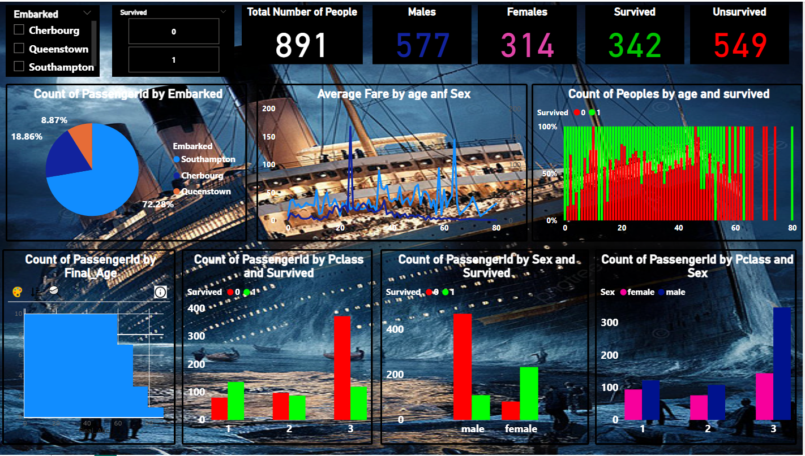

# Titanic Power BI Report

## Overview
This Power BI report provides an interactive visualization of the Titanic dataset, offering insights into passenger demographics, survival rates, and other key factors influencing survival outcomes. The dashboard includes various visualizations, such as bar charts, pie charts, and line graphs, to analyze the data effectively.

## Features
- **Passenger Demographics**
  - Total number of passengers: 891
  - Male: 577 | Female: 314
  - Embarkation distribution (Cherbourg, Queenstown, Southampton)

- **Survival Analysis**
  - Total survivors: 342 | Non-survivors: 549
  - Survival distribution by sex
  - Survival rate based on passenger class (1st, 2nd, 3rd class)

- **Fare and Age Insights**
  - Average fare by age and gender
  - Passenger age distribution and survival rate

- **Passenger Class Analysis**
  - Count of passengers by class and gender
  - Correlation between class and survival

## Key Insights
- First-class passengers had a significantly higher survival rate than third-class passengers.
- Female passengers had a much higher survival rate compared to males.
- Passengers who embarked from Cherbourg had a higher survival rate compared to those from Southampton or Queenstown.
- Age played a role in survival, with younger passengers generally having better survival rates.

## Recommendations
- Further analysis could explore the impact of family size on survival.
- Additional filtering options could be added for deeper data exploration.
- Improving the layout and color scheme for better readability and aesthetics.

## How to Use
1. Open Power BI and load the dataset.
2. Explore interactive visualizations to gain insights.
3. Use filters to analyze specific groups (e.g., by embarkation point, gender, or class).

## Screenshots
_Add relevant screenshots of the dashboard here._

## Dataset
The dataset used in this report is the Titanic dataset from Kaggle or public sources. It includes details on passenger demographics, ticket class, fare, embarkation port, and survival status.

## License
This project is open-source and available for use and modification.

